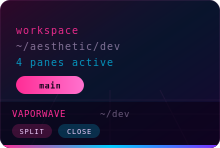
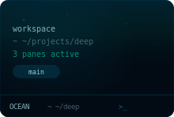
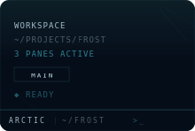

# knkode

A terminal workspace manager that saves your multi-pane layouts so you stop rebuilding them every morning.

<table>
  <tr>
    <td align="center"><br/><sub>Matrix</sub></td>
    <td align="center"><br/><sub>Cyberpunk</sub></td>
    <td align="center"><br/><sub>Vaporwave</sub></td>
    <td align="center"><br/><sub>Amber</sub></td>
  </tr>
  <tr>
    <td align="center"><br/><sub>Solana</sub></td>
    <td align="center"><br/><sub>Ocean</sub></td>
    <td align="center"><br/><sub>Sunset</sub></td>
    <td align="center"><br/><sub>Arctic</sub></td>
  </tr>
</table>

Each theme comes with its own visual effects — scanlines, phosphor glow, noise textures, gradient overlays — applied to terminal backgrounds and pane chrome. These aren't just color swaps.

## Download

Grab the latest release from [GitHub Releases](https://github.com/StanK23/knkode/releases):

- **macOS** — `.dmg` (Apple Silicon)
- **Windows** — `.exe` installer

## Why

Every project needs a different terminal setup — build watcher, dev server, logs, a shell for git. You arrange them, close the window, and rebuild the whole thing next time. knkode saves each arrangement as a named workspace you can switch between instantly.

## What it does

**Workspaces as tabs.** Each workspace is a color-coded tab with its own split-pane layout. Create, duplicate, close, drag to reorder, or reopen from the closed-workspaces menu. Switching is instant — background shells stay alive.

**Split panes.** Six layout presets plus split any pane on the fly. Drag pane headers to rearrange — drop on center to swap, drop on an edge to insert. Move panes across workspaces via right-click.

**16 themes.** 8 identity themes with unique visual effects (Matrix, Cyberpunk, Vaporwave, Amber, Solana, Ocean, Sunset, Arctic) and 8 classics (Dracula, Tokyo Night, Nord, Catppuccin, Gruvbox, Monokai, Everforest, Default Dark). Each has custom status bar chrome — parallelogram badges, CRT scanlines, gradient borders, retro grids. Status bar position (top or bottom) is configurable per workspace. Applied per-workspace, with per-pane color overrides.

**Terminal.** WebGL-rendered via xterm.js. In-terminal search, clickable URLs, CWD tracking in pane headers, per-pane startup commands. `Shift+Enter` sends LF instead of CR for tools like Claude Code.

**Quick commands.** Define reusable shell snippets per workspace. Run them from the `>_` icon on any pane header.

**Persistent.** Config stored as JSON in `~/.knkode/`. Atomic writes (temp + rename) so crashes don't corrupt state.

## Keyboard shortcuts

`Cmd` on macOS, `Ctrl` on Windows. Avoids terminal sequences (`Ctrl+C`, `Ctrl+D`).

| Action | macOS | Windows |
|---|---|---|
| Split side-by-side | `Cmd+D` | `Ctrl+D` |
| Split stacked | `Cmd+Shift+D` | `Ctrl+Shift+D` |
| Close pane | `Cmd+W` | `Ctrl+W` |
| Close workspace tab | `Cmd+Shift+W` | `Ctrl+Shift+W` |
| New workspace | `Cmd+T` | `Ctrl+T` |
| Prev / next workspace | `Cmd+Shift+[ / ]` | `Ctrl+Shift+[ / ]` |
| Prev / next pane | `Cmd+Alt+Left / Right` | `Ctrl+Alt+Left / Right` |
| Focus pane by number | `Cmd+1-9` | `Ctrl+1-9` |
| Find in terminal | `Cmd+F` | `Ctrl+F` |
| Settings | `Cmd+,` | `Ctrl+,` |

## Development

Requires Node.js >= 18 and [bun](https://bun.sh).

```sh
git clone https://github.com/StanK23/knkode.git
cd knkode
bun install
bun run dev
```

Opens the app with hot reload. macOS uses a frameless window with native traffic lights; Windows uses the standard title bar.

```sh
bun run test         # vitest
bun run lint         # biome check
bun run build        # compile to out/
bun run package      # build + create .dmg / .exe
```

Stack: Electron 33, React 19, TypeScript, Zustand 5, xterm.js + node-pty, allotment, Tailwind CSS 4, electron-vite, Biome.

## License

[MIT](LICENSE)
